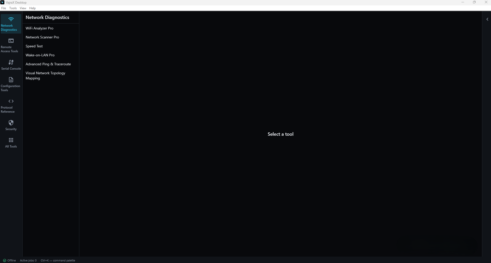
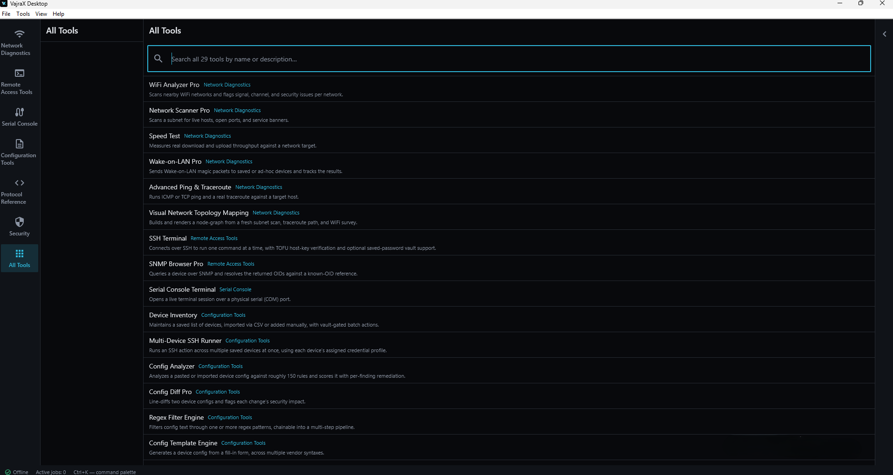
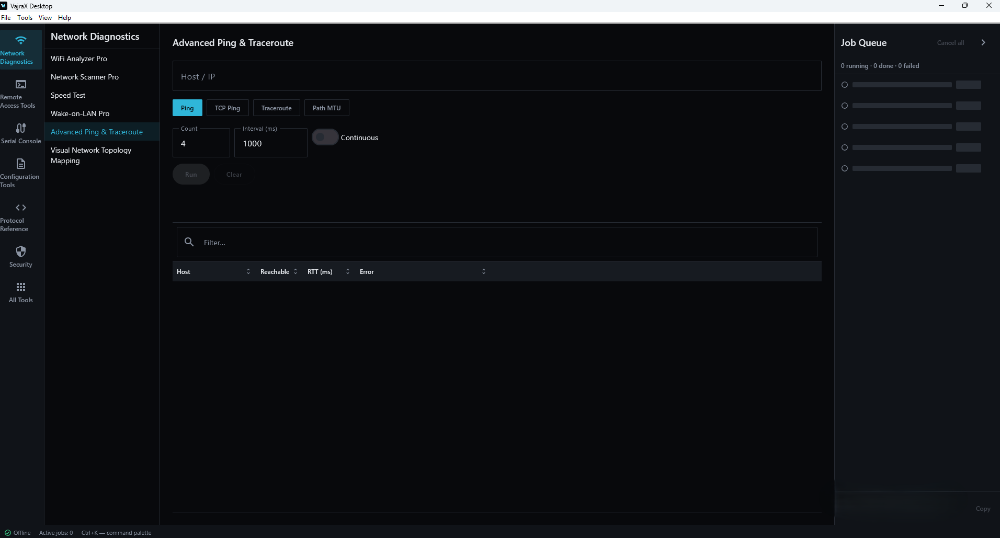
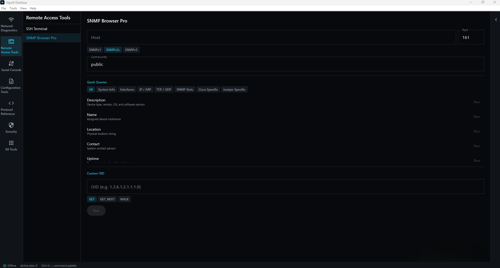
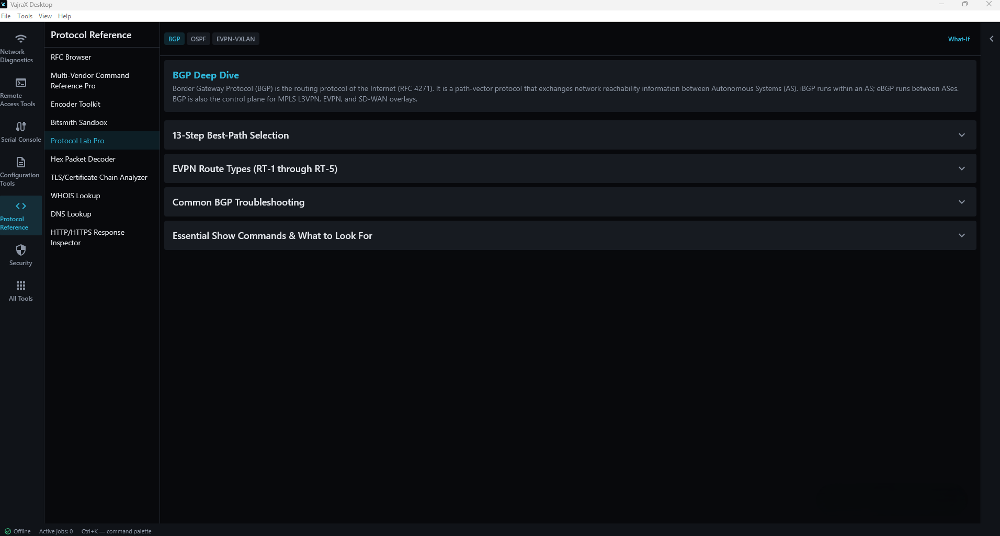
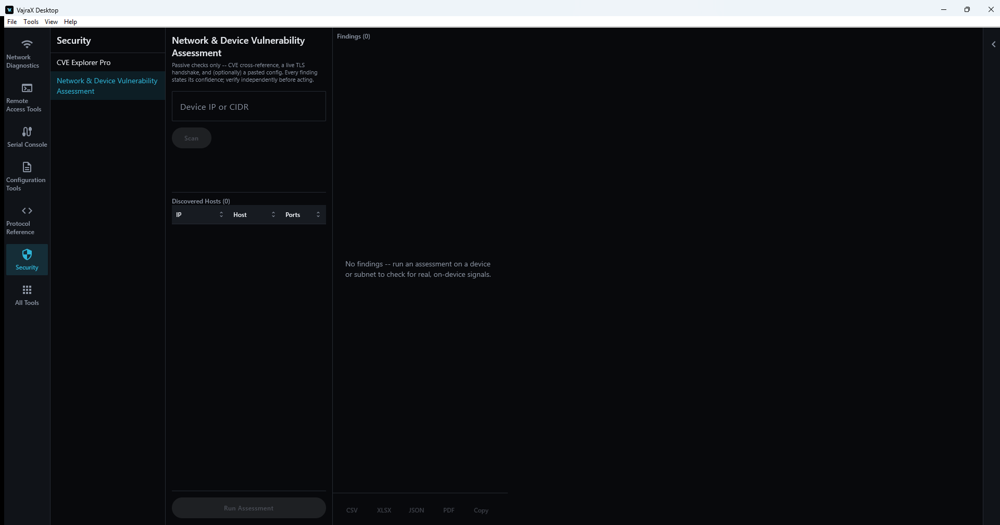

# VajraX PC for Windows

Offline-first network engineering and diagnostics toolkit for Windows.

VajraX PC for Windows is a proprietary toolkit built for network engineers, IT
administrators, and CCNA/CCNP-track learners who need real diagnostic,
configuration-analysis, and protocol-reference tools without depending on
a cloud backend. Every tool runs locally against real devices, real
packets, and real protocol data — there is no telemetry, no account, and
no offensive/exploitation tooling of any kind. This is defensive network
engineering software: inventory, diagnostics, configuration review, and
reference material, not a penetration-testing or attack framework.

VajraX is also available for Android, as a separate, independently built
and released app — see [VajraX.in](https://vajrax.in) for that version.
VajraX PC for Windows does not share a codebase, build, or release line
with it.

## Status

**v1.1.0 — Release Candidate, unsigned.** Feature-complete: 30 tools
across 6 categories. Code signing is planned but not yet in place — see
[Installation](#installation) below for what that means when you run the
installer.

## Features

30 tools across 6 categories, built around a core device-configuration
workflow (inventory → connect → analyze → compare) plus standalone
diagnostic, protocol-reference, and security tooling.

### Network Diagnostics
- **WiFi Analyzer Pro** — scans nearby WiFi networks and flags signal, channel, and security issues per network.
- **Network Scanner Pro** — scans a subnet for live hosts, open ports, and service banners.
- **Speed Test** — measures real download and upload throughput against a network target.
- **Wake-on-LAN Pro** — sends Wake-on-LAN magic packets to saved or ad-hoc devices and tracks the results.
- **Advanced Ping & Traceroute** — runs ICMP or TCP ping and a real traceroute against a target host (includes Path MTU Discovery).
- **Visual Network Topology Mapping** — builds and renders a node-graph from a fresh subnet scan, traceroute path, and WiFi survey.

### Remote Access Tools
- **SSH Terminal** — connects over SSH to run one command at a time, with TOFU host-key verification and optional saved-password vault support.
- **SNMP Browser Pro** — queries a device over SNMP and resolves the returned OIDs against a known-OID reference.

### Serial Console
- **Serial Console Terminal** — opens a live terminal session over a physical serial (COM) port.

### Configuration Tools
- **Device Inventory** — maintains a saved list of devices, imported via CSV or added manually, with vault-gated batch actions.
- **Multi-Device SSH Runner** — runs an SSH action across multiple saved devices at once, using each device's assigned credential profile.
- **Config Analyzer** — analyzes a pasted or imported device config against roughly 150 rules and scores it with per-finding remediation.
- **Config Diff Pro** — line-diffs two device configs and flags each change's security impact.
- **Regex Filter Engine** — filters config text through one or more regex patterns, chainable into a multi-step pipeline.
- **Config Template Engine** — generates a device config from a fill-in form, across multiple vendor syntaxes.
- **Multi-Vendor Translator Pro** — translates a config between vendor syntaxes and reports any features that don't carry over.
- **Config Vault** — an encrypted, password-protected vault for saved credentials, shared with SSH Terminal's saved-password unlock.
- **Config Drift Check** — compares a device's current saved config against its last version, or pulls a fresh one now and checks the real diff.

### Protocol Reference
- **RFC Browser** — searches and browses a local RFC dataset by number, title, category, or content.
- **Multi-Vendor Command Reference Pro** — looks up the equivalent command for a networking task across multiple vendor CLIs.
- **Encoder Toolkit** — converts and encodes values, such as MAC address formats, live as you type.
- **Bitsmith Sandbox** — an interactive bit-level editor for exploring IP addresses and subnet masks.
- **Protocol Lab Pro** — reference deep-dives on BGP/OSPF/EVPN-VXLAN, plus a BGP best-path what-if simulator.
- **Hex Packet Decoder** — decodes a raw hex packet dump into its protocol-layer breakdown, with MAC vendor lookup.
- **TLS/Certificate Chain Analyzer** — decodes PEM/DER certificates offline or captures a live TLS handshake, flagging weak/deprecated protocols, signatures, and keys.
- **WHOIS Lookup** — looks up a domain or IP address over the real WHOIS protocol, following the real IANA-to-registry-to-registrar (or RIR) referral chain.
- **DNS Lookup** — queries A/AAAA/CNAME/MX/TXT/NS/CAA/SOA records (plus SPF/DMARC presence and PTR for IP input) over the real DNS protocol, against the system resolver or a custom one.
- **HTTP/HTTPS Response Inspector** — requests a URL and reports its real status code, complete redirect chain, full response headers, and timing.

### Security
- **CVE Explorer Pro** — searches and filters a curated NVD-derived dataset of 116 networking/security CVEs by vendor, product, CVSS, and exploit status.
- **Network & Device Vulnerability Assessment** — scans a device or subnet and cross-references it against CVEs, a live TLS handshake, and an optional pasted config, tagging each finding with its own confidence tier (never averaged with severity) and cited remediation guidance. New in v1.1.0.

## System Requirements

- Windows 10 (version 1809 or later) or Windows 11
- 64-bit (x64)
- 8 GB RAM recommended, 6 GB minimum
- ~150 MB free disk space
- No internet connection required for core functionality

## Installation

1. Download the VajraX PC for Windows installer,
   `VajraX_Windows_1.1.0.msi`, from the
   [latest release](../../releases/latest).
2. (Recommended) Verify the download's checksum — see
   [Verifying your download](#verifying-your-download) below.
3. Run the installer.

### About the SmartScreen prompt

This release is not yet code-signed. When you run the installer, Windows
SmartScreen will most likely show **"Windows protected your PC"** with an
**Unknown publisher** warning. This is expected, standard Windows
behavior for any installer from a publisher that hasn't purchased a
code-signing certificate — it is not a sign of a problem with this
specific file.

If you want to proceed: click **More info**, then **Run anyway**.

Because there's no publisher signature to vouch for the file yet, verify
the checksum below first — that's the actual guarantee that what you
downloaded matches what was built and published.

## Verifying your download

The published SHA-256 checksum for `VajraX_Windows_1.1.0.msi` is in
`VajraX_Windows_1.1.0.msi.sha256`, attached to the same release. To check
your download in PowerShell:

    Get-FileHash VajraX_Windows_1.1.0.msi -Algorithm SHA256

Compare the output against the value in the `.sha256` file. They should
match exactly.

## License

Proprietary, closed-source software. See [LICENSE](LICENSE). This
repository distributes compiled binary releases only — no source code is
published here.
